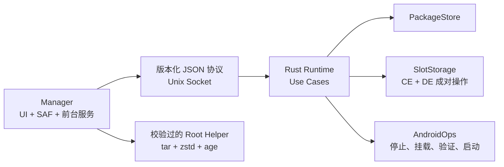

# UClone Slices V2

[](https://github.com/gkeyes/uclone-slices/actions/workflows/ci.yml)
[](LICENSE)

UClone Slices V2 是一款适用于 Root Android / KernelSU 设备的多账号空间管理工具。它可以为同一个 App 创建多个独立账号空间，并在账号之间快速切换。

当前版本为 **v0.2.2**，支持账号空间的创建、切换、备份和恢复，不包含桌面 Hook。

## 功能

- 同一个 App 可保存系统原始空间和多个独立分账号。
- 可创建空白分账号，也可复制系统原始空间。
- 点击账号即可完成切换并打开 App。
- 支持重命名、删除分账号，以及取消应用配置。
- 支持备份或恢复 Base、单个分账号和全部账号，备份默认使用密码加密。
- 三角洲行动会自动跳过可重新下载的游戏资源；恢复到已有空间时保留本地资源，只覆盖账号数据。
- 切换、备份和恢复时会自动停止并校验 App，避免账号数据混用。
- App 升降级和设备重启后保留账号配置，并可选择重启后自动打开 App。
- 备份只保存账号所需的私有数据，不包含 APK、缓存、媒体和外部存储文件。

## 运行条件

| 项目 | 当前范围 |
|---|---|
| Android | Android 10 / API 29 及以上；当前真机为 Android 17 / API 37 |
| CPU | arm64 |
| Root | KernelSU，能够加载模块并授予 Manager 权限 |
| 用户 | 已解锁的 user0 |
| App | 具有 Launcher 入口的普通第三方 App |

暂不支持工作资料、第二用户、system/shared-UID App，或 UID/签名不兼容的替换安装。身份不兼容时旧空间会被保护，不能自动接管。

## 下载与安装

Release 产物由 `Validate V2` GitHub Actions 从同一提交 SHA 生成：

1. `uclone-slices-v2-manager-0.2.2-<sha>.apk`
2. `uclone-slices-v2-kernelsu-0.2.2-<sha>.zip`
3. `SHA256SUMS.txt`

安装步骤：

1. 安装 Manager APK。
2. 在 KernelSU 中刷入模块 ZIP。
3. 重启手机并解锁 user0。
4. 打开 Manager，授予 Root 权限，确认首页显示 `Runtime 0.2.2`。

Fixture 只参与 CI 编译兼容检查，不属于正式交付物，也不用于本轮真机验收。

> 安装前必须比较手机现有 APK 与下载 APK 的证书。若 Runner 签名不同，只能对下载的 Release APK 用已验证匹配手机的 keystore 重新签名；不要卸载或清数据。

## 基本使用

1. 点击“添加应用”，选择需要管理的 App。
2. 登记后进入详情页，创建空白空间或原始空间副本。
3. 返回首页并展开账号，点击空间按钮即可切换并启动 App。
4. 当前空间使用西瓜红高亮；再次点击当前空间只重新启动 App。
5. 普通空间可在详情页重命名或删除。
6. 已配置 App 的菜单可开启“重启后自动切换并打开 App”；默认关闭时重启恢复只切换空间，不启动 App。
7. 首页进入“备份与恢复”，可备份全部账号、单独备份 Base 或单独备份一个分账号。
8. 恢复时选择 `.ucsbackup`，输入密码并核对来源；Base 目标固定，分账号可覆盖现有分账号或恢复为新分账号。
9. 同一菜单可执行“取消配置并删除分空间”。

取消配置只删除 UClone 管理的独立 CE/DE 空间和登记记录，不卸载 App，也不删除系统原始数据。

## 架构



- `PackageAggregate` 仍是唯一稳定业务状态；备份/恢复只增加可清理的事务 intent/result sidecar。
- Use Case 完整处理操作顺序和中断恢复。
- Manager 负责 SAF、归档、压缩、加密、预览和结果展示，不直接切换或替换账号目录。
- KernelSU Shell 只负责收紧控制面权限，并在 init mount namespace 启动 Runtime。
- Runtime 只保留 `PackageStore`、`SlotStorage`、`AndroidOps` 三个底层端口。

当前 wire 有十八个操作：

`probe`、`list_packages`、`get_package`、`enroll`、`rebind_package`、`create_slot`、`activate_slot`、`rename_slot`、`delete_slot`、`unenroll`、`set_launch_after_reboot`、`begin_backup_io`、`finish_backup_io`、`begin_restore_io`、`commit_restore_account`、`finish_restore_io`、`abort_account_io`、`list_account_io_status`

`probe` 保持旧格式；其余请求必须携带与 Runtime 精确匹配的稳定协议 ID。以后只新增 App 备份规则时，可以只升级 Manager。

错误码为：

`invalid_request`、`not_found`、`state_conflict`、`identity_mismatch`、`operation_failed`、`io_busy`、`backup_invalid`、`backup_password_required`、`backup_auth_failed`、`insufficient_storage`、`backup_incompatible`

## 仓库结构

- `runtime/`：Rust 聚合、Use Case、端口、生产适配器和 socket 入口。
- `manager-app/`：Compose Manager。
- `device-fixture-app/`：验证 CE/DE 隔离的测试 App。
- `protocol/fixtures/`：Rust 与 Kotlin 共用的协议 fixtures。
- `kernelsu/`：KernelSU 模块启动层。
- `docs/`：开发约束、设置来源、真机验收和 ADR。
- `tools/`：构建、只读诊断与恢复工具。

## 构建与验证

需要 JDK 17、Android SDK 36、Build Tools 36.0.0、NDK 29.0.14206865、Rust 1.95 和 Android arm64 target。

```bash
cargo fmt --all -- --check
cargo test --workspace --all-targets --locked
cargo clippy --workspace --all-targets --locked -- -D warnings
RUSTDOCFLAGS="-D warnings" cargo doc --workspace --no-deps

ANDROID_NDK_HOME=/path/to/android-ndk ./tools/build-manager-helper.sh

./gradlew --no-daemon \
  :manager-app:testDebugUnitTest \
  :manager-app:lintDebug \
  :manager-app:lintRelease \
  :manager-app:assembleDebug \
  :manager-app:assembleRelease \
  :device-fixture-app:lintFromDebug \
  :device-fixture-app:lintToDebug \
  :device-fixture-app:assembleFromDebug \
  :device-fixture-app:assembleToDebug

./tools/check-decision-alignment.sh
./tools/test-kernelsu.sh
ANDROID_NDK_HOME=/path/to/android-ndk ./tools/build-kernelsu.sh
```

真机验证步骤见 [docs/DEVICE_QA.md](docs/DEVICE_QA.md)。问题必须先由只读探针或稳定失败测试确认，再修改生产代码。

## 数据位置

- 聚合状态：`/data/adb/uclone-slices-v2/packages/<package>/aggregate.json`
- 签名身份：`/data/adb/uclone-slices-v2/packages/<package>/binding-v1.json`
- 重绑 journal：`/data/adb/uclone-slices-v2/packages/<package>/rebind-intent.json`
- 备份/恢复 journal：`/data/adb/uclone-slices-v2/packages/<package>/account-io-intent-v1.json`
- 最近恢复结果：`/data/adb/uclone-slices-v2/packages/<package>/account-io-result-v1.json`
- 首次迁移备份：`/data/adb/uclone-slices-v2/state-backups/pre-0.1.7/<package>/`
- CE 空间：`/data/misc_ce/0/uclone-slices-v2/slots/<package>/<slot>`
- DE 空间：`/data/misc_de/0/uclone-slices-v2/slots/<package>/<slot>`
- Runtime socket：`/data/adb/uclone-slices-v2/runtime.sock`
- 恢复暂存和回滚：CE/DE UClone 根下的 `transfers`、`maintenance`、`rollback`；`maintenance-base` 仅用于清理旧版本遗留别名，事务完成或恢复后统一清理。

Runtime 根目录、CE/DE 的 UClone 根、`slots` 和包名父目录均为 `root:root 0700`；socket 为 `root:root 0600`。slot 本身及其内容继续使用目标 App 的 UID、原 mode 和 MCS 标签。

备份格式、安全边界和恢复事务详见 [docs/BACKUP_RESTORE.md](docs/BACKUP_RESTORE.md)。GitHub Release 仅在用户完成真机验收并明确确认后发布。

## 开发规则

开发前请阅读 [docs/DEVELOPMENT_RULES.md](docs/DEVELOPMENT_RULES.md) 与 [docs/SETTINGS_PROVENANCE.md](docs/SETTINGS_PROVENANCE.md)。

项目不使用文件行数、目录数量、覆盖率、固定压力次数或经验重试次数代替代码质量；评估重点是职责内聚、依赖方向、公共接口和行为测试。

## License

[Apache License 2.0](LICENSE)
