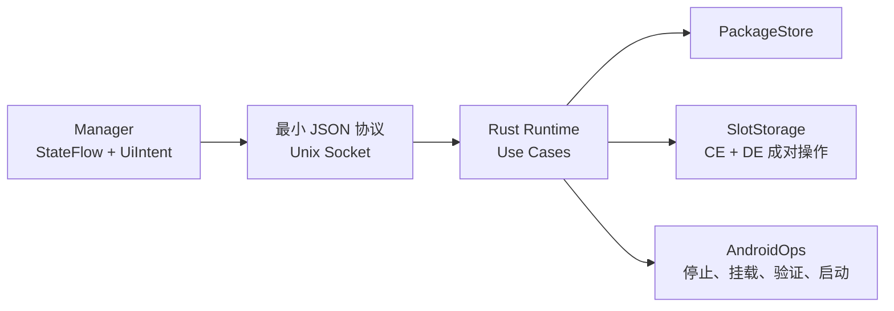

# UClone Slices V2

[](https://github.com/gkeyes/uclone-slices/actions/workflows/ci.yml)
[](LICENSE)

UClone Slices V2 是为 Root Android / KernelSU 设备重建的应用数据空间管理器。它让同一个 App 在系统原始数据与多个独立 CE/DE 数据空间之间切换，并由 Runtime 完成停止、挂载、验证和启动。

当前版本为 **v0.1.4 预发布版**。主机门禁和当前在线真机链路已经验证；尚未关闭的重启与遗留 App 回归记录在 [to-do.md](to-do.md)。

## 功能

- 为普通第三方 Launcher App 登记唯一的系统原始空间。
- 创建空白空间或系统原始空间副本。
- 在首页或详情页快速切换空间，并启动目标 App。
- 重命名普通空间，永久删除非活动普通空间。
- 取消 App 配置：切回系统原始空间，删除全部独立空间和登记记录，保留 APK 与原始数据。
- App 更新或重装导致身份变化时，由用户确认清理旧空间并重新登记。
- Runtime 事务中断后，根据持久化上下文继续收敛。
- 首页账号展开状态保存在 Manager 本地，重启 Manager 后保持不变。

## 运行条件

| 项目 | 当前范围 |
|---|---|
| Android | Android 10 / API 29 及以上；当前真机为 Android 16 / API 36 |
| CPU | arm64 |
| Root | KernelSU，能够加载模块并授予 Manager 权限 |
| 用户 | 已解锁的 user0 |
| App | 具有 Launcher 入口的普通第三方 App |

暂不支持工作资料、第二用户、system/shared-UID App、旧数据迁移，以及更新或重装后对旧空间的自动接管。

## 下载与安装

在 [Releases](https://github.com/gkeyes/uclone-slices/releases) 下载同一版本的两个产品文件：

1. `uclone-slices-v2-manager-0.1.4.apk`
2. `uclone-slices-v2-kernelsu-0.1.4.zip`

安装步骤：

1. 安装 Manager APK。
2. 在 KernelSU 中刷入模块 ZIP。
3. 重启手机并解锁 user0。
4. 打开 Manager，授予 Root 权限，确认首页显示 `Runtime 0.1.4`。

Release 同时提供各文件的 `.xz` 极致压缩版本和 `SHA256SUMS.txt`。Fixture APK 与 QA 工具仅用于验证，不是产品运行依赖。

> v0.1.4 Manager 使用当前设备已验证的开发签名，方便覆盖安装现有测试版本。

## 基本使用

1. 点击“添加应用”，选择需要管理的 App。
2. 登记后进入详情页，创建空白空间或原始空间副本。
3. 返回首页并展开账号，点击空间按钮即可切换并启动 App。
4. 当前空间使用西瓜红高亮；再次点击当前空间只重新启动 App。
5. 普通空间可在详情页重命名或删除。
6. 已配置 App 的菜单可执行“取消配置并删除分空间”。

取消配置只删除 UClone 管理的独立 CE/DE 空间和登记记录，不卸载 App，也不删除系统原始数据。

## 架构



- `PackageAggregate` 是唯一业务状态。
- Use Case 完整处理操作顺序和中断恢复。
- Manager 只提交用户意图并消费结果，不编排挂载步骤。
- KernelSU Shell 只负责在 init mount namespace 启动 Runtime。
- Runtime 只保留 `PackageStore`、`SlotStorage`、`AndroidOps` 三个底层端口。

当前 wire 只有九个操作：

`probe`、`list_packages`、`get_package`、`enroll`、`create_slot`、`activate_slot`、`rename_slot`、`delete_slot`、`unenroll`

错误码固定为：

`invalid_request`、`not_found`、`state_conflict`、`operation_failed`

## 仓库结构

- `runtime/`：Rust 聚合、Use Case、端口、生产适配器和 socket 入口。
- `manager-app/`：Compose Manager。
- `device-fixture-app/`：验证 CE/DE 隔离的测试 App。
- `protocol/fixtures/`：Rust 与 Kotlin 共用的协议 fixtures。
- `kernelsu/`：KernelSU 模块启动层。
- `docs/`：开发约束、设置来源、真机验收和 ADR。
- `tools/`：构建、只读诊断与恢复工具。

## 构建与验证

需要 JDK 17、Android SDK 36、Build Tools 36.0.0、NDK 29.0.14206865、Rust 1.95 和 Android arm64 target。

```bash
cargo fmt --all -- --check
cargo test --workspace --all-targets --locked
cargo clippy --workspace --all-targets --locked -- -D warnings
RUSTDOCFLAGS="-D warnings" cargo doc --workspace --no-deps

./gradlew --no-daemon \
  :manager-app:testDebugUnitTest \
  :manager-app:lintDebug \
  :manager-app:lintRelease \
  :manager-app:assembleDebug \
  :manager-app:assembleRelease \
  :device-fixture-app:lintDebug \
  :device-fixture-app:assembleDebug

./tools/check-decision-alignment.sh
./tools/test-kernelsu.sh
ANDROID_NDK_HOME=/path/to/android-ndk ./tools/build-kernelsu.sh
```

真机验证步骤见 [docs/DEVICE_QA.md](docs/DEVICE_QA.md)。问题必须先由只读探针或稳定失败测试确认，再修改生产代码。

## 数据位置

- 聚合状态：`/data/adb/uclone-slices-v2/packages/<package>/aggregate.json`
- CE 空间：`/data/misc_ce/0/uclone-slices-v2/slots/<package>/<slot>`
- DE 空间：`/data/misc_de/0/uclone-slices-v2/slots/<package>/<slot>`
- Runtime socket：`/data/adb/uclone-slices-v2/runtime.sock`

## 开发规则

开发前请阅读 [docs/DEVELOPMENT_RULES.md](docs/DEVELOPMENT_RULES.md) 与 [docs/SETTINGS_PROVENANCE.md](docs/SETTINGS_PROVENANCE.md)。

项目不使用文件行数、目录数量、覆盖率、固定压力次数或经验重试次数代替代码质量；评估重点是职责内聚、依赖方向、公共接口和行为测试。

## License

[Apache License 2.0](LICENSE)
