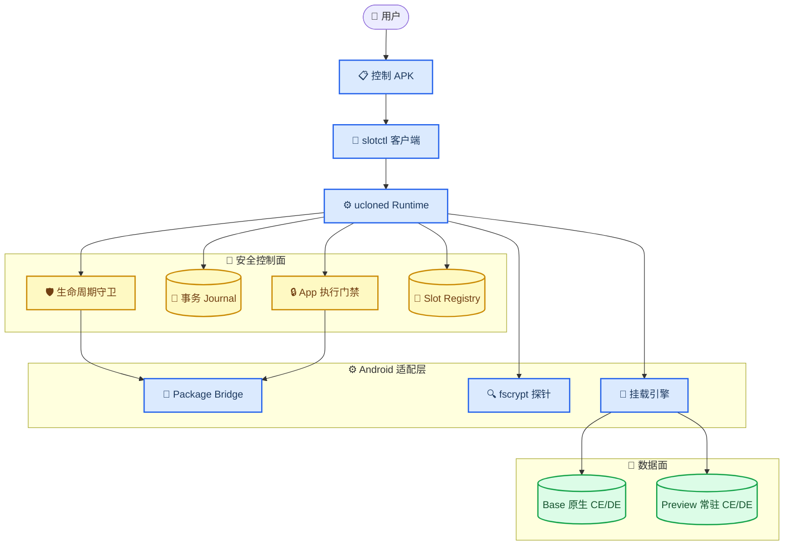
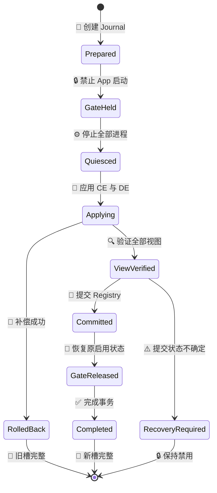

# UClone Slices Preview 跨 App 移植技术指南

_基于 `com.asksky.fitness` 在 Android 16 / HyperOS / KernelSU 真机上的 Preview Demo，更新时间：2026-07-20_

---

## 📋 文档范围与结论

本文总结 Fitness 专项 Demo 的实现经验，并定义将 Slices Preview 扩展到其他普通第三方 App 时应复用的架构、安全不变量、适配步骤和停止条件。

当前结论是：**底层快速切槽机制已经在目标设备上成立，但还不是任意 App 通用产品。** 已验证的能力是同一 APK 下，通过常驻 CE/DE 数据槽和全局传播的 bind mount，在不移动 Android 原生 Base 目录的前提下切换 App 的文件数据视图。

| 结论 | 状态 | 说明 |
| --- | --- | --- |
| Base/Preview 快速切换 | 已验证 | 后续切换不再次复制整套数据 |
| CE+DE 联动 | 已验证 | 两个域必须同时应用并验证 |
| App 进程看到 Preview | 已验证 | App 进程 CE/DE inode 与 Preview 根一致 |
| Base 原生目录保留 | 已验证 | Base 不移动、不交换、不覆盖 |
| 空白 Preview 体验 | Demo 已验证 | 当前通过安全手工处理实现，尚非自动物化能力 |
| 任意第三方 App | 未验证 | 需要逐包兼容性探测和固定目标构建 |
| 重启/解锁自动恢复 | 未验证 | 当前模块仍有 `disable` 标记，不能宣称重启可用 |
| Keystore 与系统状态隔离 | 不支持 | 文件槽不等于完整 Android 用户容器 |

> ⚠️ **边界：** 本文描述的是 Preview 工程基线，不是稳定版承诺。任何无法证明的身份、事务或数据视图都必须失败关闭，保持目标 App 禁用。

## 🔍 Fitness 真机验证基线

### 设备与运行状态

2026-07-20 的只读复核结果如下：

| 项目 | 结果 |
| --- | --- |
| 目标包 | `com.asksky.fitness` |
| Android | Android 16 / API 36 |
| ROM | HyperOS，设备代号 `popsicle` |
| Root | KernelSU 可用 |
| SELinux | `Enforcing` |
| Runtime probe | `ready=true`、`user_unlocked=true`、`ce_de_supported=true` |
| 当前槽 | `preview` |
| 生命周期 | `normal` |
| App enabled/suspended | `true / false` |
| KernelSU 模块启动 | 仍由 `disable` 标记关闭 |

### 数据视图证据

| 视图 | CE inode | DE inode | 含义 |
| --- | ---: | ---: | --- |
| Android 原生 Base | `977407` | `977417` | PackageManager 的固定原生锚点 |
| Preview 槽根 | `1560591` | `1560602` | 常驻 Preview 数据容器 |
| Fitness App 进程 | `1560591` | `1560602` | 进程实际看到 Preview |

这组证据证明的不只是 Root Shell 路径发生变化，而是目标 App 进程自身的 `/data/user/0/<package>` 与 `/data/user_de/0/<package>` 已指向 Preview。

相关本地证据：

- [设备可行性报告](./SLICES_PREVIEW_DEVICE_FEASIBILITY.md)
- [Fitness 空白 Preview 截图](../.omo/evidence/fitness-slices/20260719-155640/live-demo/fitness-blank-preview.png)
- [最终 Runtime 产物清单](../.omo/evidence/fitness-slices/20260719-155640/artifacts/package-final-v9-gate-order-234105/package-summary.txt)
- [最终 Runtime SHA-256](../.omo/evidence/fitness-slices/20260719-155640/artifacts/package-final-v9-gate-order-234105/SHA256SUMS)

> ⚠️ **可复现性提醒：** 当前 Git `HEAD` 仍是 `c7f5b46`，Slots Preview 的 Runtime、控制 APK、目标配置和本文档仍位于 dirty/untracked 工作区。仅检出该 commit 不能重现 Fitness Demo。扩展其他 App 前，应先把本轮源码与产物清单固化为独立 Preview 基线提交或可校验源码归档。

### 证据解释

Fitness 的 Base 已有账号数据，空白 Preview 显示未登录界面。切到 Preview 后出现的微信“签名不对”提示由 `com.tencent.mm` 发出，而不是 Runtime 身份校验失败。Base 和 Preview 共用同一个 APK，Slots 不修改 `/data/app` 或签名。

该现象说明两件事：

1. 文件数据槽确实切换到了空白状态
2. 微信开放平台、APK 签名、AppID 等外部身份不随文件槽隔离

## 🏗️ 可复用系统架构

### 组件关系



### 组件职责

| 组件 | 技术 | 职责 |
| --- | --- | --- |
| 控制 APK | Java/Android | 固定操作入口、确认、结果展示 |
| `slotctl` | Rust | 受限 CLI、类型化请求/响应 |
| [`ucloned`](../slot-runtime/src/bin/ucloned.rs) | Rust | 事务编排、挂载、恢复、状态收敛 |
| Package Bridge | Java `app_process` | 读取 UID、签名、版本、启用状态与 PackageManager inode |
| `slot-fsprobe` | C | 校验 fscrypt policy 和固定路径 |
| [KernelSU 脚本](../slot-kernelsu/emergency-containment.sh) | Shell | 启动钩子、应急 containment、救援入口 |
| Launcher/LSPosed 模块 | 可选 | 未来只提供长按入口，不参与数据操作 |

当前 Demo 实际需要一个控制 APK 和一个 KernelSU Runtime 模块。模块内的 `slot-bridge.apk` 是 `app_process` 运行载体，不是需要用户单独安装的第三个 App。

## 💾 数据目录与挂载模型

### 固定存储布局

以 Fitness 为例：

```text
/data/user/0/com.asksky.fitness
└── Android 原生 Base CE，不移动

/data/user_de/0/com.asksky.fitness
└── Android 原生 Base DE，不移动

/data/misc_ce/0/uclone-slices-preview/slots/com.asksky.fitness/preview
└── Preview CE 常驻容器

/data/misc_de/0/uclone-slices-preview/slots/com.asksky.fitness/preview
└── Preview DE 常驻容器

/data/adb/uclone-slices-preview
└── Registry、Journal、Gate、日志和 socket，不保存长期 CE 登录态
```

选择 `/data/misc_ce/0` 和 `/data/misc_de/0` 的目的，是让两套槽分别继承 user0 的 CE/DE 加密域。`/data/adb` 只承担控制面，避免把长期登录态降级到设备加密域。

### Base 与 Preview 不变量

| 检查项 | Base 活动 | Preview 活动 |
| --- | --- | --- |
| CE/DE 数据来源 | Android 原生目录 | 对应 Preview 根 |
| 受管 canonical mount 层 | `0 / 0` | `1 / 1` |
| PackageManager inode | 始终为 Base | 始终为 Base |
| canonical 视图 | Base inode | Preview inode |
| `/data_mirror` 视图 | Base inode | Preview inode |
| Zygote 视图 | Base inode | Preview inode |
| App 进程视图 | Base inode | Preview inode |

Android 上同一数据目录存在 canonical、`/data/data` 别名、`/data_mirror` 和 App namespace 等多种观察路径。实现不能只验证 `mount --bind` 返回成功，必须证明这些观察面一致。

Fitness 设备上的 Preview 传播路径为：

```text
/data/user/0/com.asksky.fitness
/data/data/com.asksky.fitness
/data_mirror/data_ce/null/0/com.asksky.fitness
/data/user_de/0/com.asksky.fitness
/data_mirror/data_de/null/0/com.asksky.fitness
```

其中 Runtime 的有界挂载不变量统计 canonical CE/DE 各一层；完整 `mountinfo` 出现五个目标视图，是同一 CE+DE 数据视图在 Android alias/mirror 结构中的传播结果，不应误判为五次重复挂载。

### 首次物化与空白槽

当前物化器的正式源码行为是：

```text
Base CE/DE
→ 复制到 staging
→ 校验树与安全元数据
→ 发布为 Preview
```

因此首次创建的 Preview 默认与 Base 内容相同。这能够验证挂载正确，却无法直观看到两套账号状态。

Fitness Demo 中的空白 Preview 是在已安全切回 Base、目标 App 停止后，仅清空 Preview 根目录下的内容实现的；Preview 根 inode、UID/GID、mode、SELinux context 和 fscrypt policy 均被保留。**该过程尚未实现为可重复的 Runtime 功能。**

扩展到其他 App 前，建议正式增加类型化 `seed_mode`：

| 模式 | 行为 | 适用场景 |
| --- | --- | --- |
| `clone_base` | 首次复制 Base | 保留同一起点后再分别修改 |
| `blank` | 创建安全空槽 | 第二账号、首次启动体验 |

`blank` 不能等价为对任意路径执行 `rm -rf`。正确实现应创建 CE/DE staging 根、继承加密策略、应用安全元数据、验证空树，再原子发布。

## 🔄 切换事务与生命周期

### 正常与失败路径



### Commit point

[Registry](../slot-runtime/src/registry) 是活动槽的持久 commit point，[Journal](../slot-runtime/src/journal) 记录事务推进过程：

```text
Prepared
→ GateHeld
→ ProcessesQuiesced
→ Applying
→ ViewVerified
→ Committing
→ RegistryCommitted
→ GateReleased
→ Completed
```

恢复逻辑不能只看“最后执行到哪条 Shell 命令”。它必须同时读取 Registry commit point、Journal、Gate lease 和现场 inode，才能决定回滚、前滚或进入 `RecoveryRequired`。

### PackageLifecycleGuard

| 现场变化 | 决策 |
| --- | --- |
| UID 或签名变化 | `Quarantined`，对外视为 `RecoveryRequired(identity_changed)` |
| PackageManager Base inode 漂移 | `RecoveryRequired` |
| canonical 与进程视图不一致 | `RecoveryRequired` |
| 版本/codePath 非受管变化 | `RecoveryRequired` |
| Base 视图完整 | 允许 Base |
| Preview 视图完整 | 允许 Preview |

`status` 不是只读 Registry 文本。生产路径会重新采样 PackageManager 身份、canonical inode 和 App/Zygote 进程视图，再经过 [`PackageLifecycleGuard`](../slot-runtime/src/lifecycle.rs) 后才报告 `normal`。

## 🔐 必须保留的安全不变量

| 不变量 | 工程要求 |
| --- | --- |
| 固定目标 | 包名、user、槽名和路径从构建配置生成 |
| 禁止任意路径 | CLI 不接受用户提供的数据源或 mount 目标 |
| Base 不可移动 | 不 rename、不交换、不覆盖 Base 根 |
| CE/DE 成对切换 | 任一域失败都不能提交 |
| 先 Gate 后修改 | 门禁验证前不得挂载或物化 |
| 进程完全静止 | 主进程、远程进程和相关进程必须全部退出 |
| 挂载层有界 | Base 为 `0/0`，Preview 为 `1/1`，禁止叠加 |
| 多视图一致 | canonical、mirror、Zygote、App 进程必须同 inode |
| 精确恢复 Gate | 恢复任务前的 enabled/suspended，而非无条件 enable |
| Journal 先行 | 修改数据视图前先持久化事务意图 |
| 不确定即关闭 | 未知状态只能禁用 App 并进入 `RecoveryRequired` |
| 救援独立 | `rescue.sh` 不依赖控制 APK 界面可用 |
| 系统最小侵入 | 不改系统分区、不用 OverlayFS、不放宽 SELinux |
| 模块默认禁用 | 新 ZIP 自带 KernelSU `disable` 标记 |

允许的可运行终态只有：

```text
完整 Base
完整 Preview
App 被禁用且 RecoveryRequired
```

## 📚 Fitness 实现中的关键经验

### 已修复问题

| 症状 | 根因 | 可复用规则 |
| --- | --- | --- |
| 空白 Registry 时 daemon 不监听 socket | 把首次未登记误判为损坏 | `Absent` 必须是合法 clean-start 状态 |
| containment watcher 提前退出 | 只执行一次禁用 | 管理痕迹存在期间必须持续监护 |
| Gate 查询偶发超时 | 完整 Package probe 解析 ABX 过重 | 启用状态使用轻量 `probe-gate` |
| 普通切换在 Gate 前失败 | 先验证 containment、后 acquire | 固定顺序为 acquire → verify → quiesce |
| 失败 enroll 遗留 Gate | 未证明 Base 就恢复状态 | 先证明 Base，再精确恢复 Gate lease |
| Preview 与 Base 账号相同 | 首次槽是 Base 克隆 | 功能证明与产品可见状态证明必须分开 |
| 微信提示“签名不对” | 微信开放平台校验外部身份 | APK 签名/AppID 不是文件槽数据 |

### Demo 真正证明了什么

已证明：

- 一个 APK 可以对应两套常驻 CE/DE 文件数据
- Base 与 Preview 可以通过 mount 视图快速切换
- App 进程、Zygote、canonical 和 mirror 能看到一致 Preview inode
- 空白 Preview 可以呈现未登录状态，Base 数据仍保留
- 第三方认证失败不会被误报为 Runtime 签名变化

尚未证明：

- 所有 Android 16 / HyperOS 设备具有相同 namespace 拓扑
- 任意 App 都没有 Shared UID、App Zygote 或 isolated process 问题
- 模块启用后的重启/解锁恢复已经安全
- Keystore、系统账户、通知和服务端状态能按槽隔离
- 当前源码能够自动创建空白 Preview

## 🎯 其他 App 的兼容性与隔离边界

### 准入分类

| 检查 | 结果 | 当前策略 |
| --- | --- | --- |
| 普通 user0 第三方 App | 通过候选 | 继续探测 |
| Shared UID | 阻断 | 不支持 |
| 系统/特权 App | 阻断 | 不支持 |
| Launcher、输入法、VPN、设备管理器 | 阻断 | 不支持 |
| Direct Boot 关键组件 | 高风险 | 首版阻断 |
| App Zygote | 高风险 | 未能完整归属时阻断 |
| isolated process | 高风险 | 未能完整归属时阻断 |
| adoptable storage | 未验证 | 阻断 |
| CE/DE mirror 路径不唯一 | 阻断 | `RecoveryRequired` |
| 数据树含 symlink/special/hardlink | 当前物化阻断 | 不静默复制 |
| App 正在更新 | 阻断 | 先回 Base 并完成更新事务 |

### 数据隔离矩阵

| 数据类型 | 当前隔离程度 | 说明 |
| --- | --- | --- |
| CE 文件 | 隔离 | SharedPreferences、SQLite、WebView 通常在此 |
| DE 文件 | 隔离 | 与 CE 联动切换 |
| `Android/data` | 不隔离 | 当前 Preview 未接管外部私有目录 |
| `Android/media` / OBB | 不隔离 | 默认共享 |
| Android Keystore | 共享 | 同 user0、同 UID 的 alias 空间不分槽 |
| Runtime permissions / AppOps | 共享 | 属于 package/user 系统状态 |
| AccountManager | 共享 | 由系统服务维护 |
| 通知频道、Widget、Job、Alarm | 共享或未验证 | 不属于 CE/DE 文件槽承诺 |
| APK 签名与版本 | 共享 | 所有槽使用同一 APK |
| 服务端设备绑定 | 共享或服务端决定 | 不能通过文件挂载隔离 |

因此产品名称应保持“文件数据槽”或“Slots Preview”，不能宣传成多个完整 Android 用户。

## ⚙️ 扩展到新 App 的实施流程

### 阶段 1：建立固定目标配置

Fitness 的单一配置源是 [`slot-targets/fitness.toml`](../slot-targets/fitness.toml)：

```toml
package = "com.asksky.fitness"
user = 0
base_slot = "base"
preview_slot = "preview"
module = "uclone-slices-preview"
```

当前工具链仍硬编码只接受 `slotprobe` 和 `fitness`。新增第三个 App 时，**不能只增加 TOML 文件**，还必须扩展以下固定 profile allowlist：

- [`tools/render-target-profile.sh`](../tools/render-target-profile.sh)
- [`slot-runtime/build.rs`](../slot-runtime/build.rs)
- [`tools/build-slot-runtime-android.sh`](../tools/build-slot-runtime-android.sh)
- [`tools/package-kernelsu-preview.sh`](../tools/package-kernelsu-preview.sh)
- [`slot-fsprobe/Makefile`](../slot-fsprobe/Makefile)
- [`slot-bridge/build.gradle.kts`](../slot-bridge/build.gradle.kts)
- [`slot-preview-controller/build.gradle.kts`](../slot-preview-controller/build.gradle.kts)
- [`tools/test-target-profiles.sh`](../tools/test-target-profiles.sh)

生成器应继续为 Rust、Java、C、Shell 和产物 manifest 生成同一份路径事实，并通过 `target-profile.properties` 进行跨产物一致性校验。

### 阶段 2：只读包与设备探测

任何写入前至少记录：

1. packageName、UID、签名 SHA-256、versionCode、codePath
2. PackageManager CE/DE inode
3. enabled、suspended 和自动更新状态
4. canonical、mirror、Zygote 和现有 App 进程 inode
5. Shared UID、Direct Boot、App Zygote、remote/isolated process
6. CE/DE 根 UID/GID、mode、SELinux context 和 fscrypt policy
7. 数据大小、文件类型以及物化器不支持的树结构

任一关键观察面缺失、冲突或无法归属时，停止在探测阶段。

### 阶段 3：构建单包产物

Fitness 已验证的构建顺序可作为模板：

```bash
# Rust arm64 Runtime
./tools/build-slot-runtime-android.sh --profile fitness

# Java app_process Bridge
gradle -p slot-bridge appProcessArtifact test \
  -PtargetProfile=fitness --no-daemon

# C fscrypt/path 探针
make -C slot-fsprobe test android-check TARGET_PROFILE=fitness

# 控制 APK
gradle :slot-preview-controller:testDebugUnitTest \
  :slot-preview-controller:lintDebug \
  :slot-preview-controller:assembleDebug \
  -PtargetProfile=fitness --no-daemon

# 默认禁用的 KernelSU ZIP
./tools/package-kernelsu-preview.sh \
  --profile fitness \
  --output .omo/evidence/slices-preview-package-fitness
```

迁移到新 profile 后，将每个 `fitness` 替换为新 profile 名称。打包必须拒绝不同 profile 的 Rust、Bridge、fsprobe 和 Shell 混装。

### 阶段 4：安全登记与首次槽创建

按以下顺序执行：

1. 保持 KernelSU 模块 `disable` 标记存在
2. 把独立 Base 救援脚本保存到模块外和电脑
3. 停止目标 App并建立执行门禁
4. 记录 Base 身份、安全元数据与 CE/DE inode
5. 执行 `enroll`，确认 Registry 仍指向原生 Base
6. 使用 `clone_base` 或未来的 `blank` 物化 Preview
7. 验证 Preview CE/DE inode 与 Base 不同
8. 切换 Preview，并从 App 进程内部验证 inode
9. 切回 Base，确认受管 mount 层归零

CLI 形状如下，其中 `<compiled-package>` 只能是当前构建产物固定的包名：

```bash
slotctl probe
slotctl enroll <compiled-package>
slotctl status <compiled-package>
slotctl switch <compiled-package> preview
slotctl switch <compiled-package> base
slotctl reconcile
slotctl rescue <compiled-package> --to-base
```

### 阶段 5：产品可见 A/B 验证

1. 在 Base 建立一个不涉及账号、支付或敏感数据的本地状态 A
2. 在 Preview 建立不同的本地状态 B
3. 执行一次 `Base → Preview → Base`
4. 确认 UI、CE/DE inode、mount 层和 App 进程视图同时正确
5. 再执行少量往返切换，确认没有重复物化或挂载叠加

当前控制 APK只执行命令并显示结果，不会自动启动目标 App。未来若增加“切换并打开”，必须在收到 typed committed 响应并再次 `status` 验证后才能启动。

### 阶段 6：停止条件

出现以下任一情况立即停止该 App 的 Preview 适配：

- UID、签名、codePath 或 PackageManager inode 异常变化
- CE 与 DE 只成功一侧
- canonical、mirror、Zygote 或 App 进程 inode 不一致
- mount 层超过预期
- Gate 无法证明或无法恢复原始状态
- 事务、Registry 或 Journal 无法确定 commit point
- 目标 App 在 Gate 持有期间重新产生可写进程
- Base 视图无法无损恢复

停止后不得自动启用目标 App，只能进入 `RecoveryRequired` 或使用已验证的 Base 救援。

## 📍 从单包 Demo 到多 App 产品

### 近期可执行路线

继续采用“一种目标 profile 对应一套固定产物”的模式。它不够便利，但攻击面小，适合逐 App Preview：

```text
新 App 只读探测
→ 新建固定 profile
→ 构建专用 APK/Runtime
→ 单 App Demo
→ 记录兼容性结论
```

下一个最有价值的源码改动不是压力测试，而是：

1. 实现正式 `blank` 物化模式
2. 把 profile allowlist 收敛为一个可审计的生成源
3. 为控制 APK 增加完整 Status、typed result 和手动启动入口
4. 在专用测试包完成一次重启/解锁恢复，再开放真实 App 重启测试
5. 形成按包的兼容性报告和阻断理由

### 中期多 App 架构

当多个 App 分别通过验证后，再把单包编译配置升级为签名、版本化的 Target Registry。多 App Runtime 仍必须遵守：

- 包名和路径由 Registry 派生，不接受任意 Shell 路径
- 每个 package/user 独立 Registry、Journal、Gate 和救援状态
- 同一 UID 的包必须作为整体拒绝或整体管理
- Launcher 入口只发送 package + slot 的类型化请求
- Runtime 在每次切换前重新校验签名、UID、版本和 Base inode

推荐最终产品形态：

```text
UClone APK
├── 数据迁移与恢复
└── Slots Preview

KernelSU Runtime
├── mount / Journal / Gate
├── boot reconcile
└── rescue

Launcher/LSPosed 模块（可选）
└── 长按选择槽并转发请求
```

Restore Engine 继续承担跨 user 导入、快照、修复和历史恢复；Slot Engine 只承担 user0 内常驻数据槽的日常快速切换。两套能力可以融合在同一 UClone App 中，但不能混用事务语义。

---

_维护要求：每新增一个目标 App，都应在本文件对应章节或独立兼容性报告中记录设备、包身份、数据视图、已知外部状态和最终安全终态。_
